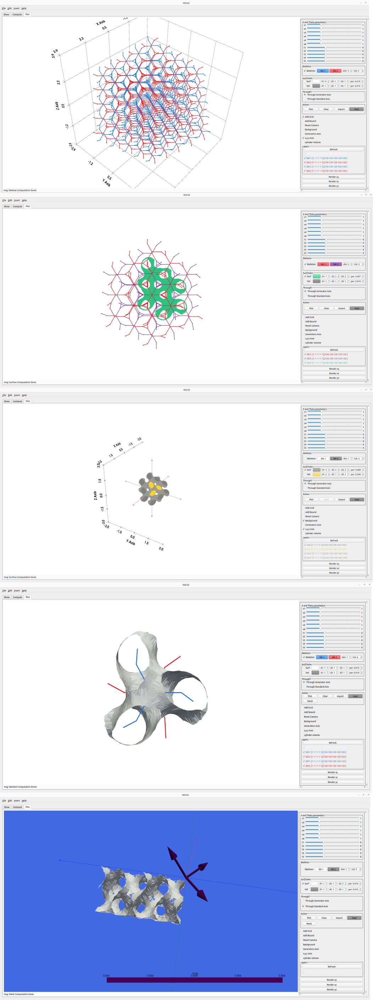

# TPMS-Lattice-Studio
A simple studio to work with lattice structures and build porous shapes using PyQt5 and Pyvista.
Part of the lib ```./include/``` used for medial axis section in [TPMS Studio](https://tpmsstudio.com/) software.
The core  Lattice functions and linalgebra calculations are written in c++. The front end is done with PyQt and Pyvista.

- Pyvista is used since it's much easier to mange skeletons with it.
- I previous version, I used Eigen for algebraic calculations. Here, in this version, I refused to do calculations with Eigen since ```linalgebra.h``` is much faster as tested.




